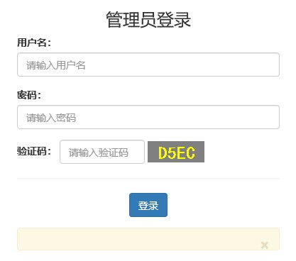
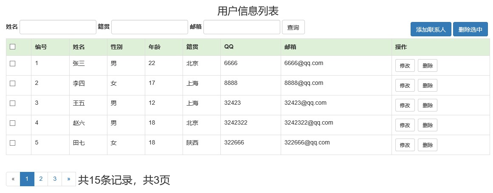
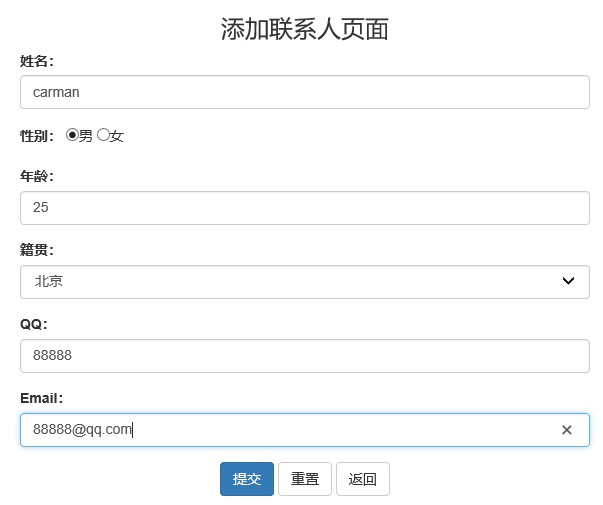
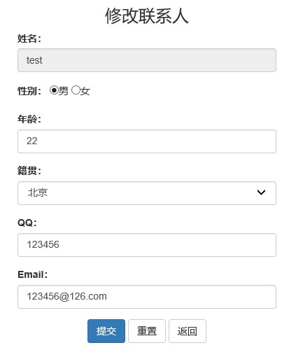

## 用户信息管理系统
### 开发环境
- Windows 10
- IntelliJ IDEA 2019.3
- MySQL Server 5.5
- Tomcat-8.5.31
- jdk-9.0.4
### 实现功能
- 管理员登录功能
- 查询所有用户信息功能：分页，模糊查询
- 添加用户功能
- 删除用户功能：删除单条，删除多条
- 修改用户信息功能
### 功能展示
- 管理员登陆页面 

- 查询所有用户信息页面 

- 添加用户页面 

- 修改用户信息页面 

### 数据库
- sql建表语句位于./util/sql/sql.txt

### TODO
- 管理员忘记密码功能
- 使用更加复杂验证码
